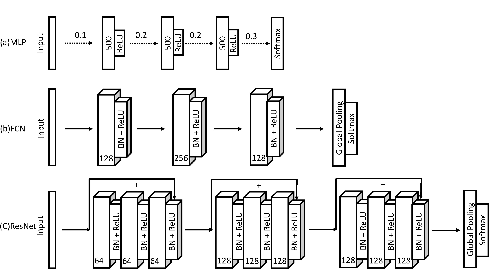
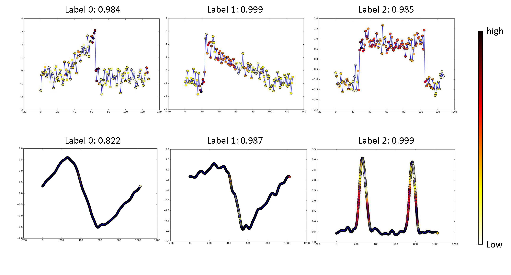
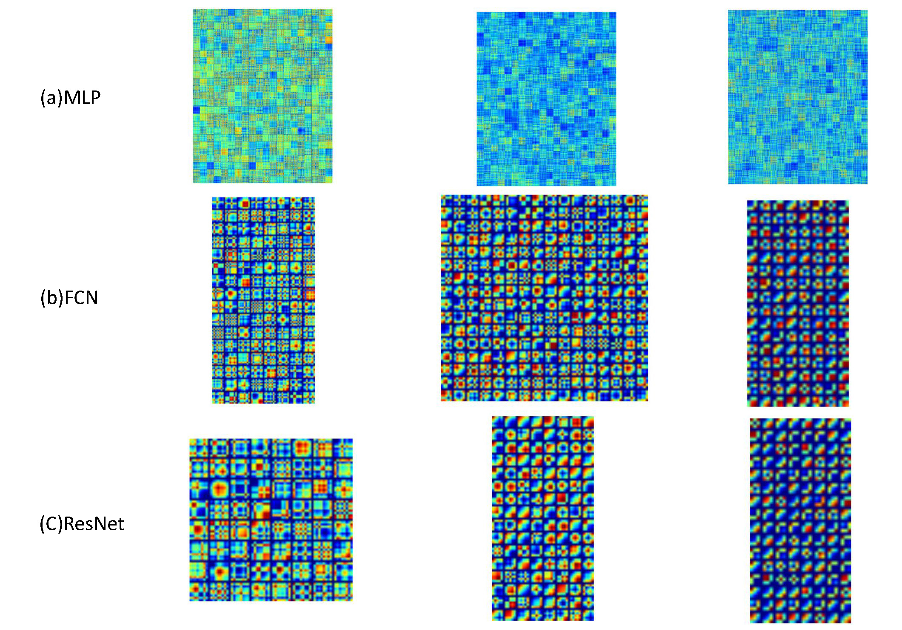

# Deep Learning for Time Series Classification 
As the simplest type of time series
data, univariate time series provides a reasonably good starting
point to study the temporal signals. The representation
learning and classification research has found many potential
application in the fields like finance, industry, and health care. Common similarity measures like Dynamic Time Warping (DTW) or the Euclidean Distance (ED) are decades old. Recent efforts on different feature engineering and distance measures designing give much higher accuracy on the UCR time series classification benchmarks (like BOSS [[1]](http://link.springer.com/article/10.1007%2Fs10618-015-0441-y),[[2]](http://link.springer.com/article/10.1007%2Fs10618-014-0377-7), PROP [[3]](http://link.springer.com/article/10.1007/s10618-014-0361-2) and COTE [[4]](http://ieeexplore.ieee.org/stamp/stamp.jsp?arnumber=7069254)) but also let to the pitfalls of higher complexity and interpretability. 

The exploition on the deep neural networks, especially
convolutional neural networks (CNN) for end-to-end time
series classification are also under active exploration like multi-channel CNN (MC-CNN) [[5]](http://link.springer.com/article/10.1007/s11704-015-4478-2)
and multi-scale CNN (MCNN) [[6]](https://arxiv.org/abs/1603.06995). However, they still need heavy preprocessing and a large set of hyperparameters which would make
the model complicated to deploy. 

This repository contains three deep neural networks models (MLP, FCN and ResNet) for the pure end-to-end and interpretable time series analytics. These models provide a good baseline for both application for real-world data and future research in deep learning on time series.

## Before Start
What is the best approach to classfiy time series? Very hard to say. From the experiments we did, COTE, BOSS are among the best and DL-based appraoch (FCN, ResNet or MCNN) show no significant difference with them. If you prefer white box model, try BOSS first. If you like end-to-end solution, use FCN or even MLP with dropout as your fisrt baseline (FCN also support a certain level of model interpretability as from CAM or grad-CAM). 

However, the UCR time series is kind of the 'extremely ideal data'. In a more applicable scenario, highly skewed labels with very non-stationary dynamics and frequent distribution/concept drift occur everywhere. Hopefully we can address these more complex issue with a very neat and effective DL based framework to enable end-2-end solution with good model interpretability , and yeah, we are exactly working on it.   

## Network Structure

Three deep neural network architectures are exploited to provide a fully comprehensive baseline.

## Localize the Contributing Region with Class Activation Map 
Another benefit of FCN and ResNet with the global average pooling
layer is its natural extension, the class activation map (CAM)
to interpret the class-specific region in the data [[7]](https://arxiv.org/abs/1512.04150).

We can see that the discriminative
regions of the time series for the right classes are highlighted.
We also highlight the differences in the CAMs for the different
labels. The contributing regions for different categories are
different. The CAM provides a natural way to find out the contributing
region in the raw data for the specific labels. This enables
classification-trained convolutional networks to learn to localize
without any extra effort. Class activation maps also allow
us to visualize the predicted class scores on any given time
series, highlighting the discriminative subsequences detected
by the convolutional networks. CAM also provide a way to
find a possible explanation on how the convolutional networks
work for the setting of classification.

## Visualize the Filter/Weights 
We adopt the Gramian Angular Summation Field (GASF)
[[8]](https://arxiv.org/abs/1506.00327) to visualize the filters/weights in the neural networks. The weights from the second and the
last layer in MLP are very similar with clear structures and
very little degradation occurring. The weights in the first layer,
generally, have the higher values than the following layers.

## Classification Results
This table provides the testing (not training) classification error rate on 85 UCR time series data sets. For more experimental settings please refer to our paper. 

Please note that the 'best' row is not a reasonable peformance measure. The MPCE score is TODO.

|                                |       |        |       |       |         |          |         |       | 
|--------------------------------|-------|--------|-------|-------|---------|----------|---------|-------| 
|       | **MLP**                            | **FCN**   | **ResNet** | **PROP**  | **COTE**  | **1NN-DTW** | **1NN-BOSS** | **BOSS-VS**|
| 50words                        | 0.288 | 0.321  | 0.273 | 0.180 | 0.191   | 0.310    | 0.301   | 0.367 | 
| Adiac                          | 0.248 | 0.143  | 0.174 | 0.353 | 0.233   | 0.396    | 0.220   | 0.302 | 
| ArrowHead                      | 0.177 | 0.120  | 0.183 | 0.103 | /       | 0.337    | 0.143   | 0.171 | 
| Beef                           | 0.167 | 0.25   | 0.233 | 0.367 | 0.133   | 0.367    | 0.200   | 0.267 | 
| BeetleFly                      | 0.150 | 0.050  | 0.200 | 0.400 | /       | 0.300    | 0.100   | 0.000 | 
| BirdChicken                    | 0.200 | 0.050  | 0.100 | 0.350 | /       | 0.250    | 0.000   | 0.100 | 
| Car                            | 0.167 | 0.083  | 0.067 | /     | /       | /        | /       | /     | 
| CBF                            | 0.14  | 0      | 0.006 | 0.002 | 0.001   | 0.003    | 0       | 0.001 | 
| ChlorineCon                    | 0.128 | 0.157  | 0.172 | 0.360 | 0.314   | 0.352    | 0.340   | 0.345 | 
| CinCECGTorso                   | 0.158 | 0.187  | 0.229 | 0.062 | 0.064   | 0.349    | 0.125   | 0.130 | 
| Coffee                         | 0     | 0      | 0     | 0     | 0       | 0        | 0       | 0.036 | 
| Computers                      | 0.460 | 0.152  | 0.176 | 0.116 |         | 0.300    | 0.296   | 0.324 | 
| CricketX                       | 0.431 | 0.185  | 0.179 | 0.203 | 0.154   | 0.246    | 0.259   | 0.346 | 
| CricketY                       | 0.405 | 0.208  | 0.195 | 0.156 | 0.167   | 0.256    | 0.208   | 0.328 | 
| CricketZ                       | 0.408 | 0.187  | 0.187 | 0.156 | 0.128   | 0.246    | 0.246   | 0.313 | 
| DiatomSizeR                    | 0.036 | 0.07   | 0.069 | 0.059 | 0.082   | 0.033    | 0.046   | 0.036 | 
| DistalPhalanxOutlineAgeGroup   | 0.173 | 0.165  | 0.202 | 0.223 | /       | 0.208    | 0.180   | 0.155 | 
| DistalPhalanxOutlineCorrect    | 0.190 | 0.188  | 0.180 | 0.232 | /       | 0.232    | 0.208   | 0.282 | 
| DistalPhalanxTW                | 0.253 | 0.210  | 0.260 | 0.317 | /       | 0.290    | 0.223   | 0.253 | 
| Earthquakes                    | 0.208 | 0.199  | 0.214 | 0.281 | /       | 0.258    | 0.186   | 0.193 | 
| ECG200                         | 0.080 | 0.100  | 0.130 | /     | /       | 0.230    | 0.130   | 0.180 | 
| ECG5000                        | 0.065 | 0.059  | 0.069 | 0.350 | /       | 0.250    | 0.056   | 0.110 | 
| ECGFiveDays                    | 0.03  | 0.015  | 0.045 | 0.178 | 0       | 0.232    | 0.000   | 0.000 | 
| ElectricDevices                | 0.420 | 0.277  | 0.272 | 0.277 | /       | 0.399    | 0.282   | 0.351 | 
| FaceAll                        | 0.115 | 0.071  | 0.166 | 0.152 | 0.105   | 0.192    | 0.210   | 0.241 | 
| FaceFour                       | 0.17  | 0.068  | 0.068 | 0.091 | 0.091   | 0.170    | 0       | 0.034 | 
| FacesUCR                       | 0.185 | 0.052  | 0.042 | 0.063 | 0.057   | 0.095    | 0.042   | 0.103 | 
| fish                           | 0.126 | 0.029  | 0.011 | 0.034 | 0.029   | 0.177    | 0.011   | 0.017 | 
| FordA                          | 0.231 | 0.094  | 0.072 | 0.182 | /       | 0.438    | 0.083   | 0.096 | 
| FordB                          | 0.371 | 0.117  | 0.100 | 0.265 | /       | 0.406    | 0.109   | 0.111 | 
| GunPoint                       | 0.067 | 0      | 0.007 | 0.007 | 0.007   | 0.093    | 0       | 0     | 
| Ham                            | 0.286 | 0.238  | 0.219 | /     | /       | 0.533    | 0.343   | 0.286 | 
| HandOutlines                   | 0.193 | 0.224  | 0.139 | /     | /       | 0.202    | 0.130   | 0.152 | 
| Haptics                        | 0.539 | 0.449  | 0.494 | 0.584 | 0.481   | 0.623    | 0.536   | 0.584 | 
| Herring                        | 0.313 | 0.297  | 0.406 | 0.079 | /       | 0.469    | 0.375   | 0.406 | 
| InlineSkate                    | 0.649 | 0.589  | 0.635 | 0.567 | 0.551   | 0.616    | 0.511   | 0.573 | 
| InsectWingbeatSound            | 0.369 | 0.598  | 0.469 | /     | /       | 0.645    | 0.479   | 0.430 | 
| ItalyPower                     | 0.034 | 0.03   | 0.040 | 0.039 | 0.036   | 0.050    | 0.053   | 0.086 | 
| LargeKitchenAppliances         | 0.520 | 0.104  | 0.107 | 0.232 | /       | 0.205    | 0.280   | 0.304 | 
| Lightning2                     | 0.279 | 0.197  | 0.246 | 0.115 | 0.164   | 0.131    | 0.148   | 0.262 | 
| Lightning7                     | 0.356 | 0.137  | 0.164 | 0.233 | 0.247   | 0.274    | 0.342   | 0.288 | 
| MALLAT                         | 0.064 | 0.02   | 0.021 | 0.050 | 0.036   | 0.066    | 0.058   | 0.064 | 
| Meat                           | 0.067 | 0.033  | 0.000 | /     | /       | 0.067    | 0.100   | 0.167 | 
| MedicalImages                  | 0.271 | 0.208  | 0.228 | 0.245 | 0.258   | 0.263    | 0.288   | 0.474 | 
| MiddlePhalanxOutlineAgeGroup   | 0.265 | 0.232  | 0.240 | 0.474 | /       | 0.250    | 0.218   | 0.253 | 
| MiddlePhalanxOutlineCorrect    | 0.240 | 0.205  | 0.207 | 0.210 | /       | 0.352    | 0.255   | 0.350 | 
| MiddlePhalanxTW                | 0.391 | 0.388  | 0.393 | 0.630 | /       | 0.416    | 0.373   | 0.414 | 
| MoteStrain                     | 0.131 | 0.05   | 0.105 | 0.114 | 0.085   | 0.165    | 0.073   | 0.115 | 
| NonInvThorax1                  | 0.058 | 0.039  | 0.052 | 0.178 | 0.093   | 0.210    | 0.161   | 0.169 | 
| NonInvThorax2                  | 0.057 | 0.045  | 0.049 | 0.112 | 0.073   | 0.135    | 0.101   | 0.118 | 
| OliveOil                       | 0.60  | 0.167  | 0.133 | 0.133 | 0.100   | 0.167    | 0.100   | 0.133 | 
| OSULeaf                        | 0.43  | 0.012  | 0.021 | 0.194 | 0.145   | 0.409    | 0.012   | 0.074 | 
| PhalangesOutlinesCorrect       | 0.170 | 0.174  | 0.175 | /     | /       | 0.272    | 0.217   | 0.317 | 
| Phoneme                        | 0.902 | 0.655  | 0.676 | /     | /       | 0.772    | 0.733   | 0.825 | 
| Plane                          | 0.019 | 0      | 0     |       | /       | /        | /       | /     | 
| ProximalPhalanxOutlineAgeGroup | 0.176 | 0.151  | 0.151 | 0.117 | /       | 0.195    | 0.137   | 0.244 | 
| ProximalPhalanxOutlineCorrect  | 0.113 | 0.100  | 0.082 | 0.172 | /       | 0.216    | 0.131   | 0.134 | 
| ProximalPhalanxTW              | 0.203 | 0.190  | 0.193 | 0.244 | /       | 0.263    | 0.203   | 0.248 | 
| RefrigerationDevices           | 0.629 | 0.467  | 0.472 | 0.424 | /       | 0.536    | 0.512   | 0.488 | 
| ScreenType                     | 0.592 | 0.333  | 0.293 | 0.440 | /       | 0.603    | 0.544   | 0.464 | 
| ShapeletSim                    | 0.517 | 0.133  | 0.000 | /     | /       | 0.350    | 0.044   | 0.022 | 
| ShapesAll                      | 0.225 | 0.102  | 0.088 | 0.187 | /       | 0.232    | 0.082   | 0.188 | 
| SmallKitchenAppliances         | 0.611 | 0.197  | 0.203 | 0.187 | /       | 0.357    | 0.200   | 0.221 | 
| SonyAIBORobot                  | 0.273 | 0.032  | 0.015 | 0.293 | 0.146   | 0.275    | 0.321   | 0.265 | 
| SonyAIBORobotII                | 0.161 | 0.038  | 0.038 | 0.124 | 0.076   | 0.169    | 0.098   | 0.188 | 
| StarLightCurves                | 0.043 | 0.033  | 0.025 | 0.079 | 0.031   | 0.093    | 0.021   | 0.096 | 
| Strawberry                     | 0.033 | 0.031  | 0.042 | /     | /       | 0.060    | 0.042   | 0.024 | 
| SwedishLeaf                    | 0.107 | 0.034  | 0.042 | 0.085 | 0.046   | 0.208    | 0.072   | 0.141 | 
| Symbols                        | 0.147 | 0.038  | 0.128 | 0.049 | 0.046   | 0.050    | 0.032   | 0.029 | 
| SyntheticControl               | 0.05  | 0.01   | 0.000 | 0.010 | 0.000   | 0.007    | 0.030   | 0.040 | 
| ToeSegmentation1               | 0.399 | 0.031  | 0.035 | 0.079 | /       | 0.228    | 0.048   | 0.031 | 
| ToeSegmentation2               | 0.254 | 0.085  | 0.138 | 0.085 | /       | 0.162    | 0.038   | 0.069 | 
| Trace                          | 0.18  | 0      | 0     | 0.010 | 0.010   | 0        | 0       | 0     | 
| TwoLeadECG                     | 0.147 | 0      | 0     | 0.067 | 0.015   | 0.096    | 0.016   | 0.001 | 
| TwoPatterns                    | 0.114 | 0.103  | 0     | 0     | 0       | 0        | 0.004   | 0.015 | 
| UWaveGestureLibraryAll         | 0.046 | 0.174  | 0.132 | 0.199 | 0.196   | 0.272    | 0.241   | 0.270 | 
| UWaveX                         | 0.232 | 0.246  | 0.213 | 0.283 | 0.267   | 0.366    | 0.313   | 0.364 | 
| UWaveY                         | 0.297 | 0.275  | 0.332 | 0.290 | 0.265   | 0.342    | 0.312   | 0.336 | 
| UWaveZ                         | 0.295 | 0.271  | 0.245 | 0.029 | /       | 0.108    | 0.059   | 0.098 | 
| wafer                          | 0.004 | 0.003  | 0.003 | 0.003 | 0.001   | 0.020    | 0.001   | 0.001 | 
| Wine                           | 0.204 | 0.111  | 0.204 | /     | /       | 0.426    | 0.167   | 0.296 | 
| WordSynonyms                   | 0.406 | 0.42   | 0.368 | 0.226 | /       | 0.252    | 0.345   | 0.491 | 
| Worms                          | 0.657 | 0.331  | 0.381 | /     | /       | 0.536    | 0.392   | 0.398 | 
| WormsTwoClass                  | 0.403 | 0.271  | 0.265 | /     | /       | 0.337    | 0.243   | 0.315 | 
| yoga                           | 0.145 | 0.155  | 0.142 | 0.121 | 0.113   | 0.164    | 0.081   | 0.169 | 
| Best | 6 | 27 | 21 | 14 | 10 | 4 | 21 | 9 | 

## Dependencies
Keras (Tensorflow backend), Numpy.

## Cite
If you find either the codes or the results are helpful to your work, please kindly cite our paper 

[**Time Series Classification from Scratch with Deep
Neural Networks: A Strong Baseline**] (https://arxiv.org/abs/1611.06455)

[**Imaging Time-Series to Improve Classification and Imputation**] (https://arxiv.org/abs/1506.00327)

## License
This project is licensed under the MIT License.

MIT License

Copyright (c) [2019] [Zhiguang Wang]

Permission is hereby granted, free of charge, to any person obtaining a copy
of this software and associated documentation files (the "Software"), to deal
in the Software without restriction, including without limitation the rights
to use, copy, modify, merge, publish, distribute, sublicense, and/or sell
copies of the Software, and to permit persons to whom the Software is
furnished to do so, subject to the following conditions:

The above copyright notice and this permission notice shall be included in all
copies or substantial portions of the Software.

THE SOFTWARE IS PROVIDED "AS IS", WITHOUT WARRANTY OF ANY KIND, EXPRESS OR
IMPLIED, INCLUDING BUT NOT LIMITED TO THE WARRANTIES OF MERCHANTABILITY,
FITNESS FOR A PARTICULAR PURPOSE AND NONINFRINGEMENT. IN NO EVENT SHALL THE
AUTHORS OR COPYRIGHT HOLDERS BE LIABLE FOR ANY CLAIM, DAMAGES OR OTHER
LIABILITY, WHETHER IN AN ACTION OF CONTRACT, TORT OR OTHERWISE, ARISING FROM,
OUT OF OR IN CONNECTION WITH THE SOFTWARE OR THE USE OR OTHER DEALINGS IN THE
SOFTWARE.
